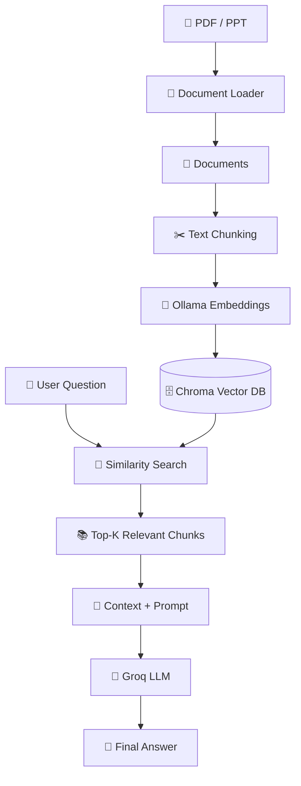

<div align="center">

# 📚 RAG Document Assistant

### 🤖 Ask Questions. Retrieve Knowledge. Get Grounded Answers.


<br/>


</div>

---

## 🎥 Project Demo

<div align="center">

<!-- Replace this GIF with your own project demo GIF -->


</div>

> 💡 **Tip:** Record your application running with OBS or ScreenToGif and upload the GIF to your GitHub repository. A real project GIF will look much better than a generic animation.

---

# 🧠 What is RAG?

**RAG = Retrieval-Augmented Generation**

RAG combines **information retrieval** with **Large Language Models (LLMs)**.

Instead of asking an LLM to answer only from its existing knowledge, the system first searches your documents for relevant information and then provides that information to the LLM.

### Without RAG

```text
User Question
      ↓
     LLM
      ↓
  Answer
````

### With RAG

```text
User Question
      ↓
Retrieve Relevant Information
      ↓
Add Context to Prompt
      ↓
     LLM
      ↓
Grounded Answer
```

---

# 🚀 What Does This Project Do?

Imagine you have a **100-page Machine Learning PDF**.

Instead of manually searching through the document, simply ask:

```text
"What is XGBoost?"
```

The system automatically:

```text
📄 Upload PDF
      ↓
📖 Read Document
      ↓
✂️ Split into Chunks
      ↓
🧠 Generate Embeddings
      ↓
🗄️ Store in Chroma
      ↓
🔎 Retrieve Relevant Chunks
      ↓
📝 Build Context
      ↓
🤖 Send Context to Groq LLM
      ↓
💬 Generate Answer
```

---

# 💡 Real Example

### 📄 Document

Suppose your PDF contains:

```text
XGBoost is an optimized distributed gradient
boosting library designed to be highly efficient,
flexible and portable.
```

### 👤 User

```text
What is XGBoost?
```

### 🔎 Retriever

Finds the relevant chunk:

```text
XGBoost is an optimized distributed gradient
boosting library...
```

### 🤖 LLM

Generates:

```text
XGBoost is a machine learning library based
on gradient boosting. It is designed to be
efficient, flexible and scalable.
```

---

# 🏗️ Architecture



---

# 🔄 Complete RAG Pipeline

```text
             DOCUMENT INGESTION
                    │
                    ▼
             📄 PDF / PPT
                    │
                    ▼
             📖 Document Loader
                    │
                    ▼
               ✂️ Chunking
                    │
                    ▼
              🧠 Embeddings
                    │
                    ▼
              🗄️ Chroma DB
                    │
                    │
             ───────┼────────
                    │
                    ▼
              USER QUERY
                    │
                    ▼
             🔎 RETRIEVAL
                    │
                    ▼
          📚 Relevant Chunks
                    │
                    ▼
              📝 PROMPT
                    │
                    ▼
               🤖 GROQ
                    │
                    ▼
              💬 ANSWER
```

---

# 🛠️ Tech Stack

| Technology                        | Purpose                      |
| --------------------------------- | ---------------------------- |
| 🐍 Python                         | Core programming             |
| 🔗 LangChain                      | RAG components               |
| 🧠 LangGraph                      | Agent workflow & memory      |
| 📄 PyPDFLoader                    | PDF processing               |
| 📊 Unstructured                   | PowerPoint processing        |
| ✂️ RecursiveCharacterTextSplitter | Chunking                     |
| 🦙 Ollama                         | Local model runtime          |
| 🧠 OllamaEmbeddings               | Embedding generation         |
| 🗄️ Chroma                        | Vector database              |
| ⚡ Groq                            | LLM inference                |
| 🔐 python-dotenv                  | Environment variables        |
| 🦙 LlamaParse                     | Advanced parsing *(planned)* |

---

# 📚 Current Features

* [x] 📄 PDF document loading
* [x] 📊 PowerPoint document loading
* [x] ✂️ Text chunking
* [x] 🧠 Ollama embeddings
* [x] 🗄️ Chroma vector database
* [x] 🔎 Similarity search
* [x] 🎯 Top-K retrieval
* [x] 📝 Context-based prompting
* [x] ⚡ Groq LLM
* [x] 🧠 LangGraph memory
* [x] 🤖 LangChain Agent
* [x] 🔐 `.env` support

---

# 🚧 Advanced RAG Roadmap

### 📄 Document Processing

* [ ] 🦙 LlamaParse
* [ ] 📚 Multiple document support
* [ ] 📄 DOCX support
* [ ] 📑 TXT / CSV support
* [ ] 🧩 Advanced document parsing

### 🏷️ Metadata

* [ ] Metadata extraction
* [ ] Metadata filtering
* [ ] Page-level metadata
* [ ] Document-level metadata
* [ ] Source tracking

### 🔎 Retrieval

* [x] Similarity Search
* [x] Top-K Retrieval
* [ ] Retriever abstraction
* [ ] Similarity scores
* [ ] MMR
* [ ] Hybrid Search
* [ ] BM25

### 🏆 Retrieval Optimization

* [ ] Reranking
* [ ] Query Rewriting
* [ ] Query Transformation
* [ ] Multi-Query Retrieval
* [ ] Context Compression

### 🖼️ Multimodal RAG

* [ ] Image extraction
* [ ] Chart understanding
* [ ] Vision LLM
* [ ] Image embeddings
* [ ] Multimodal retrieval

### 📊 Evaluation

* [ ] Retrieval evaluation
* [ ] Context relevance
* [ ] Answer relevance
* [ ] Faithfulness
* [ ] Hallucination evaluation
* [ ] RAG benchmarking

---

# 🧩 Understanding the Important RAG Components

### 📖 Parsing

Converts complex documents into structured information.

```text
PDF
 ↓
Parser
 ↓
Clean Text + Tables + Structure
```

Planned:

**LlamaParse**

---

### ✂️ Chunking

Breaks large documents into smaller pieces.

```text
100 Page PDF
      ↓
Chunk 1
Chunk 2
Chunk 3
...
Chunk N
```

Current configuration:

```python
RecursiveCharacterTextSplitter(
    chunk_size=500,
    chunk_overlap=100
)
```

---

### 🧠 Embeddings

Convert text into numerical vectors.

```text
"Machine Learning"
        ↓
[0.21, -0.45, 0.73, ...]
```

Current model:

```text
nomic-embed-text:latest
```

---

### 🗄️ Vector Database

Stores document embeddings.

```text
Document Chunk
      ↓
Embedding
      ↓
Chroma
```

---

### 🔎 Retrieval

Finds the most relevant chunks for the user's question.

```text
10,000 Chunks
      ↓
User Question
      ↓
Similarity Search
      ↓
Top 5 Chunks
```

Current implementation:

```python
vectorstore.similarity_search(
    query=query,
    k=5
)
```

---

### 🏆 Reranking

Reranking improves the order of retrieved documents.

```text
Retriever
   ↓
10 Candidate Chunks
   ↓
Reranker
   ↓
Best 3 Chunks
   ↓
LLM
```

**Retriever:** finds potentially relevant information.

**Reranker:** determines which retrieved information is most relevant.

---

# 📊 Example of Retrieval + Reranking

User asks:

```text
"What is XGBoost accuracy?"
```

Retriever returns:

```text
1. XGBoost Introduction
2. SVM Accuracy
3. XGBoost Accuracy
4. Dataset Information
5. Training Process
```

Reranker may reorder them:

```text
🏆 XGBoost Accuracy
🥈 XGBoost Introduction
🥉 Training Process
```

The best context is then passed to the LLM.

---

# 🏷️ Metadata

Metadata is **data about the document/chunk**.

Example:

```python
{
    "source": "machine_learning.pdf",
    "page": 25,
    "topic": "XGBoost",
    "year": 2026
}
```

This can later be used for:

```text
Metadata
   ↓
Filtering
   ↓
Better Retrieval
   ↓
Better Answers
```

---

# 📂 Project Structure

```text
RAG/
│
├── your_rag_file.py
├── README.md
├── requirements.txt
├── .env
├── .gitignore
│
└── sa_db/
    └── Chroma persistent database
```

---

# ⚙️ Installation

```bash
git clone <your-repository-url>

cd RAG

python -m pip install -r requirements.txt
```

Or install dependencies manually:

```bash
python -m pip install \
langchain \
langchain-community \
langchain-text-splitters \
langchain-ollama \
langchain-chroma \
langchain-groq \
langgraph \
python-dotenv
```

For LlamaParse:

```bash
python -m pip install llama-parse
```

---

# 🦙 Ollama

Make sure Ollama is installed and running.

The project currently uses:

```text
nomic-embed-text:latest
```

for generating embeddings locally.

---

# 🔑 Environment Variables

Create:

```text
.env
```

Add:

```env
GROQ_API_KEY=your_groq_api_key
LLAMA_CLOUD_API_KEY=your_llama_cloud_api_key
```

Load them using:

```python
from dotenv import load_dotenv

load_dotenv()
```

### ⚠️ Security

Never commit API keys.

Add:

```text
.env
__pycache__/
*.pyc
sa_db/
```

to `.gitignore`.

---

# ▶️ Run

```bash
python your_rag_file.py
```

You will see:

```text
Enter your name:

Enter name for your class assistant:

What do u want to upload?

1. PDF
2. PPT
```

Upload your document and start asking questions.

Example:

```text
You:
Explain supervised learning.

Assistant:
Supervised learning is a machine learning approach
where a model learns from labeled training data...
```

---

# 🌍 Real-World Applications

This architecture can be used to build:

| Domain         | Example                       |
| -------------- | ----------------------------- |
| 🎓 Education   | Ask questions about textbooks |
| 🏢 Business    | Search company policies       |
| ⚖️ Legal       | Search legal documents        |
| 🏥 Healthcare  | Document knowledge assistant  |
| 🔧 Engineering | Technical manual assistant    |
| 🔬 Research    | Research paper Q&A            |
| 🏫 College     | College document assistant    |
| 💻 Software    | Documentation assistant       |

---

# 🎯 Future Architecture

The final goal is to build:

```text
                 📚 Multiple Documents
                         ↓
                  🦙 LlamaParse
                         ↓
              ┌──────────┴──────────┐
              ↓                     ↓
           📄 Text              🖼️ Images
              ↓                     ↓
          Chunking              Vision LLM
              ↓                     ↓
          Embeddings          Image Understanding
              └──────────┬──────────┘
                         ↓
                  🗄️ Vector DB
                         ↓
                  🔎 Hybrid Search
                         ↓
                    🏆 Reranking
                         ↓
                 Context Compression
                         ↓
                  🤖 LLM / VLM
                         ↓
                  🎯 Grounded Answer
                         ↓
                  📌 Citations
```

---

# 📈 Learning Progress

```text
Python                     ████████████████████ ✅
LangChain                  ████████████████████ ✅
Basic RAG                  ████████████████████ ✅
Embeddings                 ████████████████████ ✅
Vector Database            ████████████████████ ✅
Retrieval                  ████████████████████ ✅

LlamaParse                 ███████░░░░░░░░░░░░░ 🚧
Metadata                   ███████░░░░░░░░░░░░░ 🚧
Reranking                  ████░░░░░░░░░░░░░░░░ ⏳
Hybrid Search              ███░░░░░░░░░░░░░░░░░ ⏳
Multimodal RAG             ██░░░░░░░░░░░░░░░░░░ ⏳
RAG Evaluation             ██░░░░░░░░░░░░░░░░░░ ⏳
```

---

# 🔥 Project Vision

This project is not just a document chatbot.

It is a **learning journey through modern RAG architecture**:

```text
Basic RAG
    ↓
Advanced RAG
    ↓
Multimodal RAG
    ↓
RAG Evaluation
    ↓
Optimized RAG
    ↓
Production-Ready AI Assistant 🚀
```

---

# ⭐ If You Like This Project

Give the repository a ⭐ and follow the project as it evolves!

---

<div align="center">

### 🚀 Built while learning RAG, LangChain & Generative AI

**Learn → Build → Break → Improve → Repeat**

</div>
```

### 🔥 One thing I'd strongly recommend

For the **animation**, don't use a random GIF. Make a **5–10 second screen recording of your actual RAG assistant**:

```text
Upload PDF
    ↓
"Explain XGBoost"
    ↓
🔎 Retrieving...
    ↓
🤖 Answer generated
    ↓
📄 Source: page 12
```

Save it as:

```text
assets/rag-demo.gif
```

Then replace the demo GIF section with:

```html
<p align="center">
  
</p>
```
